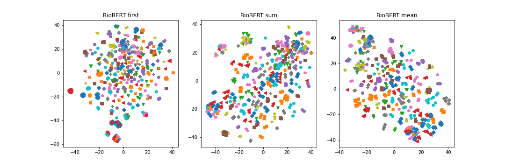

# BioBERT Embedding

To get contextualized embeddings from BioBERT-v1.1 (base), run the command below.
Note that as the output is saved in hdf5 format, you need to install the h5py package (`pip install h5py`) first.
We also provide a sample input text (`pubmed_entity_2048.txt`) which contains biomedical concepts for each line.

```bash
export MAX_LENGTH=384
export DATA_PATH=pubmed_entity_2048.txt
export OUTPUT_PATH=pubmed_entity_2048.h5
export BATCH_SIZE=64

python run_embedding.py \
    --model_name_or_path dmis-lab/biobert-base-cased-v1.1 \
    --max_seq_length  ${MAX_LENGTH} \
    --data_path ${DATA_PATH} \
    --output_path ${OUTPUT_PATH} \
    --batch_size ${BATCH_SIZE} \
    --pooling mean
```
 
## Required Arguments
-  --pooling
    - none: embeddings of a sequence of tokens
    - first: embedding of the first token (i.e., embedding at [CLS])
    - mean: embedding of mean of token embeddings
    - sum: embedding of sum of token embeddings

## Load Embeddings

```bash
export DATA_PATH=pubmed_entity_2048.txt
export OUTPUT_PATH=pubmed_entity_2048.h5

python load_embedding.py \
    --inputtext_path ${DATA_PATH}\
    --indexed_path ${OUTPUT_PATH}
```

## Result

```
The number of keys in h5: 2048
entity_name = Lohmann Selected Leghorn
embedding = [2.77513593e-01  2.03759596e-02  1.59252986e-01 ...  7.65920877e-02  2.49284402e-01 -1.48969248e-01]
```

## Visualization
The embedding of different biomedical concepts (obtained from [here](https://arxiv.org/abs/2005.00239)) are visualized below with T-SNE.
Each of different colors or shapes refers to the unique biomedical concept (having multiple synonyms).


## Contact
For help or issues using BioBERT-PyTorch, please create an issue and tag [@mjeensung](https://github.com/mjeensung).
